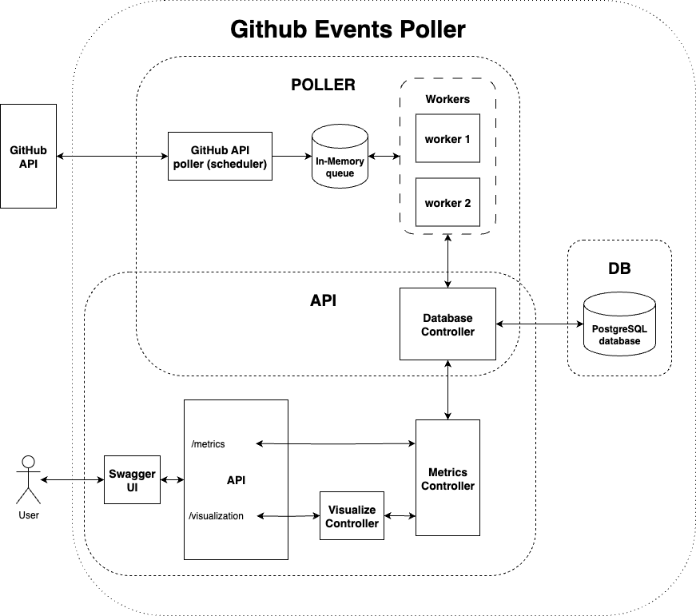

# GitHub Events Poller

**Author**: Tomas Macko  
**Email**: tomik.macko@gmail.com  
**Version**: 1.0.0  
**Date**: 2025-09-09

## Overview

This is a pet project for collecting events from GitHub, storing them in a PostgreSQL database, and exposing API endpoints to provide various metrics and visualizations.

## Architecture

The application consists of three components:

- **Poller** – Periodically fetches data from the GitHub Events API.
- **API** – A FastAPI-based service that returns computed metrics and visualizations.
- **Database** – A persistent PostgreSQL instance for storing GitHub events.

Each of these components is described below.

## Poller

The Poller calls `https://api.github.com/events` periodically. It contains two main asynchronous tasks:

- **Poller**: Fetches events and pushes responses into an internal queue.
- **Workers**: Consume from the queue and insert the data into the database.

Running tasks concurrently within an event loop ensures that we don’t block on I/O operations like database writes, especially considering GitHub’s public API rate limit of 60 requests per hour.

- Pagination is handled using `Link` headers from the GitHub API.
- When rate-limited or no more pages are available, the poller sleeps until more requests can be made.

The number of workers and queue size can be configured in the `./events_poller/settings.py` under `PollerConfig` model.

> **Note**: Initially, a more robust architecture using Redis queue and a workers deployed separately (e.g., RQ) was considered, but for the purposes of this assignment and concidering how time-consuming it'd be, this implementation was chosen.

## API

The API is built with FastAPI and provides two main groups of routes:

### `/metrics`
Returns data-driven metrics computed from GitHub events stored in the database.

- `GET /metrics/event-avg-time`  
  Returns the average time between adjacent events. Accepts `event_type` (mandatory), `action`, and `repository_name` as optional query parameters.

- `GET /metrics/events-total-count`  
  Groups events by type and returns the total counts in a given timerange specified by mandatory `offset` parameter. Additional filtering with `repository_name` and `action` parameters is supported.

- `GET /metrics/multiple-events-repos`  
  Filters repositories with more than a given number of events of a specific type. Accepts `event_type` parameter (mandatory) and `minimal_events_count` that is optional. However if not provided, the default value of 2 events is used. Value has to be a **Positive Integer**.

### `/visualization`
These endpoints return rendered HTML graphs of the metrics above.

- `GET /visualization/event-avg-time`  
  Same inputs as `/metrics/event-avg-time`, but `event_type` is optional. Plots a graph showing average time (dotted line) and per-event deltas (dots). If event_type is not provided, all available events are rendered in the plot.

- `GET /visualization/events-total-count`  
  Visualizes the total number of events per type over a given time offset. Parameters are exactly the same as for `GET /metrics/events-total-count` endpoint.

> ⚠️ **Warning:** If using Swagger UI (`/docs`), visualization endpoints will return raw HTML. For correct rendering, use the direct URL in a browser tab, or download the HTML response and open it directly in the browser.

> ℹ️ **Info:** In order to get some meaningful graphs from the `/visualization` enpoints, keep running poller for a while to have some dataset. With an empty database, graphs will be empty as well.

## Database

The project uses PostgreSQL, managed in Docker. Migrations are handled with Alembic. SQLAlchemy is used as the ORM, and async database access is supported through `asyncpg`.

- Connection pool size and TTL are configurable in `settings.py`.
- The database is used both for storing fetched data and for running tests.

## Diagram

A diagram describing the design of the architecture can be found in the `./diagram.png` file.



## Testing

The codebase includes unit tests written with `pytest` and `pytest-asyncio`.

- A separate test database (`events_poller_test`) is required for running tests.

## Local Setup

First, copy `.env_example` to `.env` and update variables if needed. Export the variables to your local environment when choosing **option 2 - Run Locally**

### Option 1: Using Docker

Build the containers:

```bash
$ docker compose build
```

Run all containers container:

```bash
$ docker compose up -d
```

> ℹ️ **Info:** The alembic migration starts with spinning up the poller container. There is no need to do it manually.

The API will be available at: [http://localhost:8000](http://localhost:8000)  
Swagger docs: [http://localhost:8000/docs](http://localhost:8000/docs) or you will be redirected to them, if no path is specified in the URL.

### Option 2: Run Locally

You can run the API and Poller locally after ensuring a PostgreSQL container is running.

Pull Postgres image:

```bash
$ docker pull postgres:15
```

Run Postgres container:

```bash
$ docker run --name postgres -e POSTGRES_PASSWORD=postgres -e POSTGRES_USER=postgres -p 5432:5432 -d postgres:15
```

Execute to Postgres container and create the DB manually:

```bash
$ docker exec -it postgres psql -U postgres -c "CREATE DATABASE events_poller;"
```

Run migrations:

```bash
$ make alembic-up
```

Or downgrade migrations:

```bash
$ make alembic-down
```

Start the Poller:

```bash
$ make serve-poller
```

Start the API:

```bash
$ make serve-api
```

### Run Tests

Create the test database `events_poller_test` in the same PostgreSQL container.  
Set `USE_TEST_DB=true` in your `.env` file, then:

Run migrations:

```bash
$ make alembic-up
```

Run tests:

```bash
$ make test
```

## Development

There is a `pre-commit` set up with basic hooks comming out-of-the box from `pre-commit-hooks` repository, as well as `ruff`. Before commiting some changes, make sure you run `pre-commit run` on changed files.
